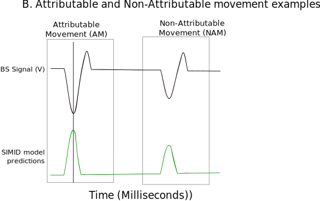
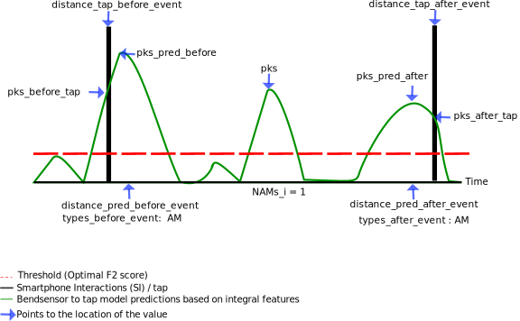

Attributable and Non attributable movements identification
==========================================================

Attributable movements (AMs) are movements that result in clear and instantaneous outcomes. Other types of movements cannot be simply attributed to any clear outcome or goal; we refer to them as non-attributable movements (NAMs). This section is on the identification of NAMs and AMS. Furthermore, to understand these movements different parameters are extracted and these are explained in this section as well.

NAMs and AMs had to be extracted from the continuous :doc:`bendsensor to tap model <bs_to_tap>` predictions. The first step towards this was to threshold the model predictions with the maximum F2 score to exclude noise (See the evaluation section in :doc:`bendsensor to tap model <bs_to_tap>`).

**Attributable movements definition**

AMs were identified, any predicted peak around +/- 100 ms of the smartphone interaction (SI) was considered a prediction of the interaction. 100 ms was chosen because this is the peak width of the model predictions averaged across all participants. Therefore, any prediction of +/- 100 ms around a SI identified an AM.

**Non Attributable movements definition**

NAMs were identified with a model prediction where there was no SI in the vicinity. This was defined as any peak of a model prediction further than +/- 1000 ms from the interaction. 1000 ms was chosen because the movement to generate an interaction usually occurred within that duration.

We distinguished between AMs and NAMs based on the model predictions of the deltas and those based on the model predictions of the integrals.

.. note:: Everything is saved in the `EEGLAB <https://eeglab.org/tutorials/ConceptsGuide/Data_Structures.html>`__ data format. The data is timelocked around the event and epoched this is then used to identify the neural correlates of these events. For this reason some functions in this section require functions from :doc:`EEG analysis <EEG_analysis>` section. Specifically the EEG preprocessing functions.

AMs and NAMs parameters
-----------------------

We also calculate a few parameters for each event. The events are either an AM, NAM as identified from the bendsensor to tap model predictions. These predictions are basically continuous values with peaks being the predicted events.

- Maximum peak value: *pks*
- Distance to the nearest smartphone interaction (tap) after the event: *distance\_tap\_after\_event*
- Distance to the nearest smartphone interaction (tap) before the event: *distance\_tap\_before\_event*
- The model prediction value at the location of the tap after the event: *pks\_after\_tap*
- The model prediction value at the location of the tap before the event: *pks\_before\_tap*
- Distance to the nearest model predicted peak (larger the set threshold of the optimal f2 score) after event: *distance\_pred\_after\_event*
- Distance to the nearest model predicted peak (larger the set threshold of the optimal f2 score) before the event: *distance\_pred\_before\_event*
- Maximum peak value after event: *pks\_pred\_after*
- Maximum peak value before event: *pks\_pred\_before*
- The type of event the nearest model prediction (either AM, NAM or None) *types\_after\_event*
- The type of event the nearest model prediction (either AM, NAM or None) *types\_before\_event*
- Boolean 1 indicating the type of the event *NAMs_i, NAMs_d, AMs_i, AMs_d, pt*

.. note:: The smartphone interaction (SI) can also be used as an event in that case it is called *pt*. The only difference is the `eventlatency <https://eeglab.org/tutorials/ConceptsGuide/Data_Structures.html#eegepoch>`__ is at the location of the tap and not the model predicted peak.

Directory structure
-------------------

::

   +-- ams_nams
   |   +-- features --> Scripts to find events (ams, nams, smartphone interactions(pt)) and epoch eeg data around them
   |   |   +-- add_events.m --> adds events to the eeglab struct
   |   |   +-- calculate_date_differences.m --> used to identify second curfew files
   |   |   +-- find_ams_n_nams.m --> finds ams and nams in the model predictions
   |   |   +-- find_nearest_distances.m --> finds nearest (1 before and 1 after) events for all participants
   |   |   +-- find_nearest.m --> finds nearest (1 before and 1 after) events for one participant
   |   |   +-- set_parameters.m --> calculates other parameters of the event
   |   |   +-- pred_events.m --> this calls all other functions and epochs the eeg data around the events
   |   +-- result_plotting
   |   |   +--  analyze_bs_to_tap_mod_results.py --> analyze model predictions and generated f2 scores plot
   |   |   +--  erp_plots.m --> plots ERP results
   |   |   +--  erp_with_CI.m --> plots ERP with confidence intervals
   |   |   +--  generate_all_epochs.m --> prepares data for generation of figure D and E
   |   |   +--  generate_bs_to_tap_model_preds.m --> prepares data for generation of figure B and C
   |   |   +--  get_ams_nam.m --> get the ams and nams for all participant in right format for plotting
   |   |   +--  plot_bs_shape_tl_ams_nams --> plot average bendsensor timelocked to ams and nams for integrals and deltas (Figure 1 B)
   |   |   +--  plot_density_am_nams.m --> plot nearest events for integrals and deltas (Figure 1 D)
   |   |   +--  plot_freq_ams_nams.m --> plot frequencies of ams and nams for integrals and deltas (Figure 1 C)
   |   |   +--  plot_inter_event_intervals.m --> plot inter event intervals for integrals and deltas (Figure 1 E)
   |   |   +--  plot_pred_tl_ams_nams.m -->  plot model predictions timelocked around ams and nams for integrals and deltas (Supplementary)

Code
----

Features
^^^^^^^^

.. mat:automodule:: ams_nams.features
   :members:

Result plotting
^^^^^^^^^^^^^^^

.. mat:automodule:: ams_nams.result_plotting_figure_1
   :members:
