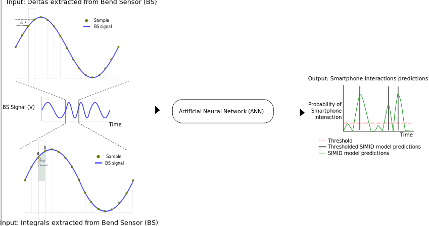
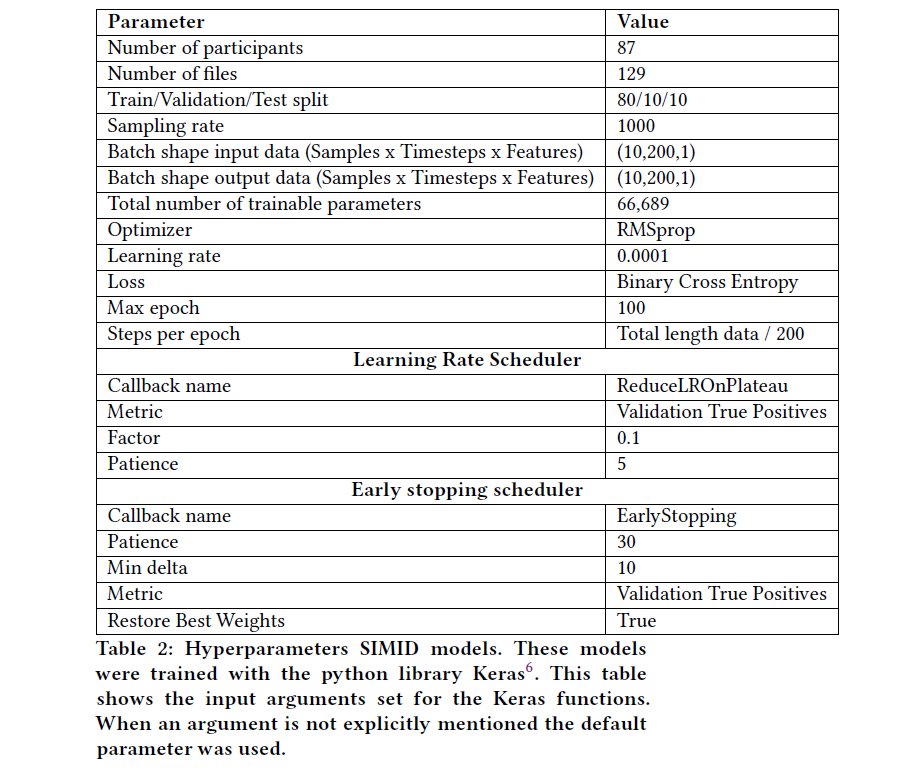

Bendsensor to Tap models
=========================

This model predicts taps from BS data.

Pre-processing
--------------

Bendsensor (BS)
~~~~~~~~~~~~~~~

All the following steps are performed on the pre-processed and aligned BS data. This means that some participants were excluded from the next steps because of unclear BS data.

1. Extract the deltas. This is done by substracting current sample with previous sample.
2. Extract the integrals. This is done with the trapezoidal rule.
3. Remove sequences larger than 10 mins with no taps.
4. Normalize data. Calculating the z-score of the data in with center 0 and standard deviation 1.
5. Seperate in multiple ‘windows’ of 10 minutes. During experimental setup participants were switching between apps approximately every 10 mins. This increases the chances that the model will see movements when using most of the different apps.
6. Downsample BS by a factor of 10.

Smartphone taps
~~~~~~~~~~~~~~~

All the following steps are performed on the aligned phone taps.

1. Remove sequences larger than 10 mins with no taps.
2. Change precision around tap. To decrese imbalance in the data and because tap measurements may be slightly off one tap is padded. This padding is set as at +/- 30.
3. Seperate in multiple ‘windows’ of 10 minutes.
4. Downsample taps by a factor of 10.

Training neural network
-----------------------

1. Each window is split with 80% train, 10% validation and 10% test.
2. The model is trained in batches of shape (samples, sequence length,
   features). Sample size is 10, Timesteps or sequence length 200 and 1
   feature.
3. The samples are generated through randomly sliced windows. Where the
   window length are equal to sequence length (Cui, Z., Chen, W., &
   Chen, Y. (2016). Multi-scale convolutional neural networks for time
   series classification. arXiv preprint arXiv:1603.06995.) For the validation set, the batch generator did not randomly select a
   sample. The samples were created based on the sequential input with a stride of 200. For example, the first sample starts at 1 ms
   up to 200 ms. The second sample 200 ms to 400 ms and so on. This essentially kept the validation data across epochs the same allowing
   for a direct comparison between the number of true positives in the validation set.
4. The model is trained with the following architecture:

::

   input_layer = keras.Input((sequence_lengeth ,num_features_bs))
   features_3 = keras.layers.Concatenate()([keras.layers.Conv1D(1, i, padding='same')(input_layer) for i in range(1,100)])
   lstm1 = keras.layers.Bidirectional(keras.layers.LSTM(128, return_sequences=True))(features_3)
   drop_1 = keras.layers.Dropout(0.5)(lstm1)
   lstm2 = keras.layers.Bidirectional(keras.layers.LSTM(128, return_sequences=True))(drop_1)
   drop_2 = keras.layers.Dropout(0.5)(lstm2)
   lstm3 = keras.layers.Bidirectional(keras.layers.LSTM(128, return_sequences=True))(drop_2)
   drop_3 = keras.layers.Dropout(0.5)(lstm3)
   out = keras.layers.Dense(1, activation='sigmoid')(drop_3)

   model = keras.Model(input_layer, [out])

   rms_prob_optimizer = tf.keras.optimizers.RMSprop(learning_rate=0.0001)

   model.compile(loss='binary_crossentropy', optimizer=rms_prob_optimizer,  metrics=['accuracy','TruePositives', 'TrueNegatives', 'FalsePositives', 'FalseNegatives'])

5. A maximum of 100 epochs was set. However, to avoid overfitting on the training set, early stopping was used. The ANNs were stopped after 30 epochs with no improvement in the number of true positive predictions in the validation set.
6. The loss function is binary crossentropy and optimizer RMSprop with a
   learning rate of 0.0001.
7. The learning rate was adjusted by a factor of 0.1 after no improvement for 5 epochs on the number of true positives in the validation set.

Hyperparameters of model
~~~~~~~~~~~~~~~~~~~~~~~~

Evaluation
----------

The evaluation consists of the following steps:

1. Calculate precision, recall for every threshold
2. Calculate F2 score for every threshold
3. Select threshold that maximizes the F2 score and threshold model
   predictions
4. Calculate confusion matrix

Directory structure
-------------------

::

   +-- bs_to_tap
   |   +-- features --> Scripts to generate the features for training
   |   |   +-- change_sequence_precision.m --> add padding around smartphone taps
   |   |   +-- create_hdf5.m --> creates the h5 data file for training
   |   |   +-- delta_mod.m --> extract deltas from BS data
   |   |   +-- delta_sigma_mod.m --> extract integrals from BS data
   |   |   +-- prepare_features.m --> gets the data in right format for training
   |   |   +-- seperate_sequences.m --> seperates input data into multiple sequences of a chosen length
   |   +-- training --> Scripts to train the model(s)
   |   |   +-- bs_to_tap.py --> trains the model and saves weights and model structure
   |   +-- predict  --> Scripts to predict the results
   |   |   +-- predictions_bs_to_tap.py --> generate model predictions and save as h5 file
   |   |   +-- read_predictions.m --> reads the predictions from the h5 file
   |   |   +-- save_predictions.m --> save the models predictions in EEGlab struct

Code
---------

Features
~~~~~~~~

.. mat:automodule:: bs_to_tap.features
   :members:

Training
~~~~~~~~

.. mat:automodule:: bs_to_tap.training.bs_to_tap
   :members:
.. autoclass:: bs_to_tap.training.bs_to_tap.BatchGenerator
   :members:

Prediction
~~~~~~~~~~

.. mat:automodule:: bs_to_tap.predict
   :members:
